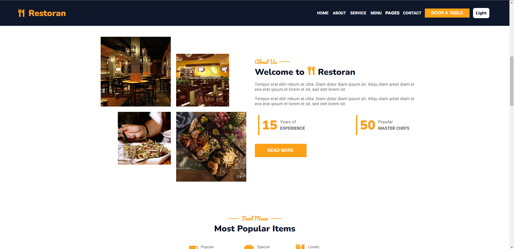
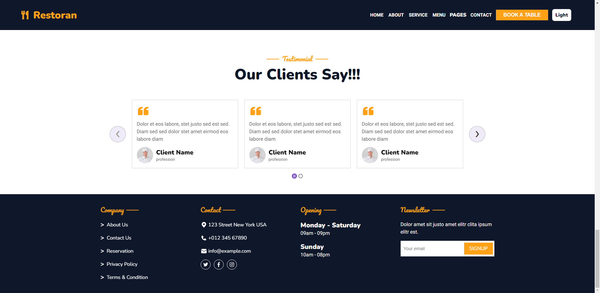
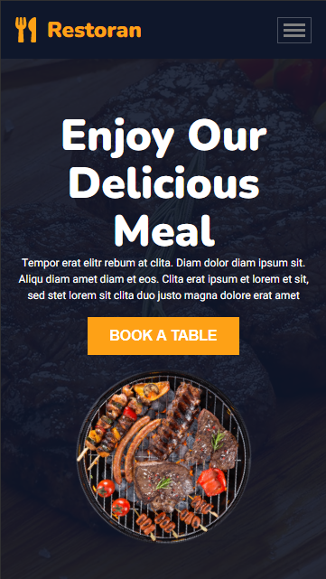
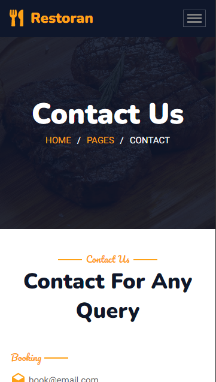
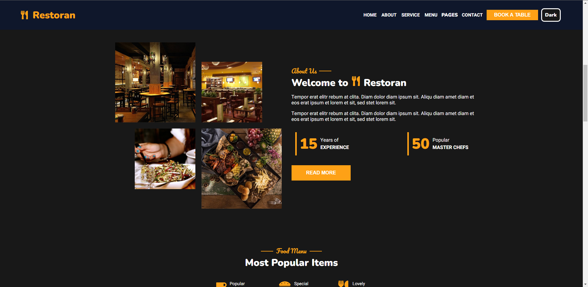

# React Multi-Page-Website

## 📝 Sobre o Projeto

Este projeto se trata da recriação de um template do bootstrap, porém refazendo o site totalmente do zero utilizando React.  
O site também conta com uma funcionalidade extra para a troca de entre temas dark/light

## ⚛️ Tecnologias Utilizadas

- React JS
- Styled-components
- React Router (v6)
- Context API
- Biblioteca react-elastic-carousel

## 💽 Como Rodar o Projeto

para baixar as dependências utilize `npm install`  
utilize o comando `npm start` para inicializar.

## 💻 Preview do Projeto

### Desktop

### Mobile

## Dark Mode

